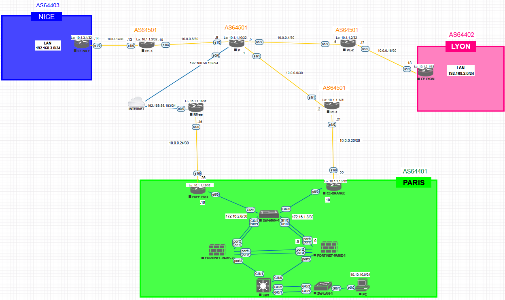

# Guide de Troubleshooting & Validation

## Diagnostics du Cœur Réseau (Cisco PE)

### 1. Vérifier le voisinage BGP VPNv4
```bash
show bgp vpnv4 unicast all summary
```
### 2. Vérifier l'import/export des routes (RT Match) 
```bash
show bgp vpnv4 unicast all tags
```

### 3. Vérifier la table de routage spécifique à la VRF
```bash
show ip route vrf <vrf_name>
```

## SD-WAN & Health Checks (Fortinet)

### 1. Statut des Health Checks
```bash
diagnose sys sdwan health-check status
```
### 2. Vérifier la règle de service (Steering)
```bash
diagnose sys sdwan service
```

## Redondance Haute Disponibilité (HA)

### 1. Vérifier l'état du cluster Paris
```bash
 get system ha status
```

# Tests de Connectivité (Proof of Concept)
1. Test MPLS Pur

Lyon vers Paris : 
 ```bash 
ping 10.1.1.1 source 10.1.2.1 
 ```

 Lyon vers Nice : 
 ```bash 
ping 10.1.3.1 source 10.1.2.1
 ```

 Lyon vers LAN Nice : 
 ```bash 
ping 192.168.3.1 source 10.1.2.1
 ```

 Lyon vers LAN Paris
 ```bash 
ping 10.10.10.x source 10.1.2.1
 ```

2. Test Failover SD-WAN :

- Lancez un ping continu depuis le LAN de Paris vers 8.8.8.8.

- Coupez l'interface port8 (Orange) sur le FortiGate.

- Résultat attendu : Basculement automatique sur le port9 (WAN-FREE).

3. Test de Segmentation VRF :

Vérifiez que le trafic du client PARIS ne peut pas atteindre les interfaces d'administration du routeur P (Isolation L3VPN).